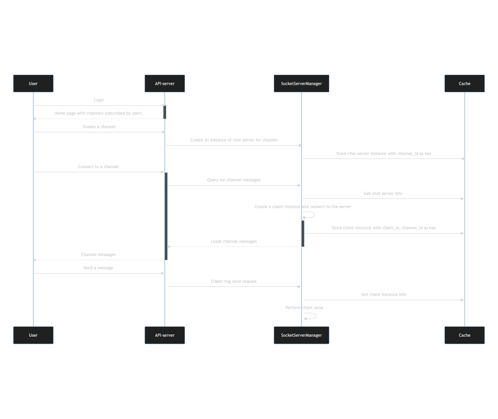

# my-chat
Instant messaging app for teams with support for threads and 1:1 messaging

# Use cases
* Every user must have an account
* Admin creates channels.
* Admin can add users to channels.
* Users can search for channels.
* Users can subscribe to channels.
* Two users can start a chat stream with each other.
* Users can send messages in channels.
* Any user can reply to any message in a channel.

> Attachment serving is out of context here (for now :) ).


# Data models (WIP)

```
    Message
        message_id bigint
        sender bigint
        receiver bigint
        text bigint
        created_at timestamp

    User
        user_id bigint
        name str
        email str
        created_at timestamp
    
    Channel
        channel_id bigint
        name str
        admin bigint
        description str
        created_at timestamp

    User-channel subscription
        subscription_id bigint
        user_id bigint FK
        channel_id FK


```
# Sequence diagram (WIP)


